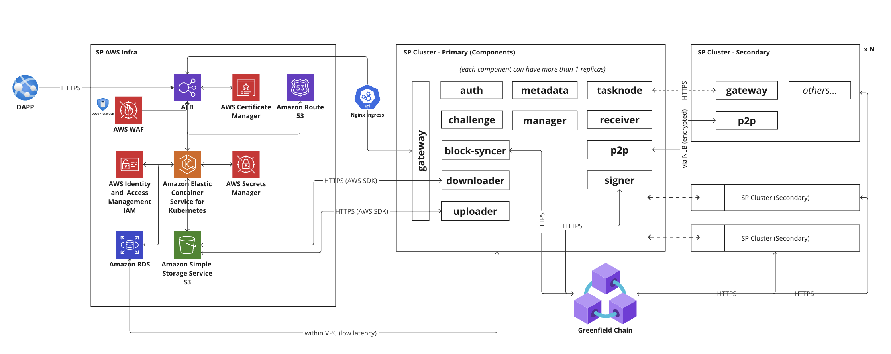

Greenfield Storage Provider Deployment Guide
============================================

Supported Cloud Providers
-------------------------
We currently support only deployment to AWS (EKS) and Alicloud (work in progress).

AWS Quick Start
---------------

For detail about what "storage provider" is on application level, please see
https://greenfield.bnbchain.org/docs/guide/storage-provider/. This document focuses on AWS infra
and K8S deployment level.

## Pre-requisites (we assume you already have the following infrastructure):
1. AWS account
2. AWS EKS available
3. K8S kustomize client

## High Level Architecture

## Steps:
1. [Create AWS resources](aws/)
2. [Create K8S resources](k8s/)

